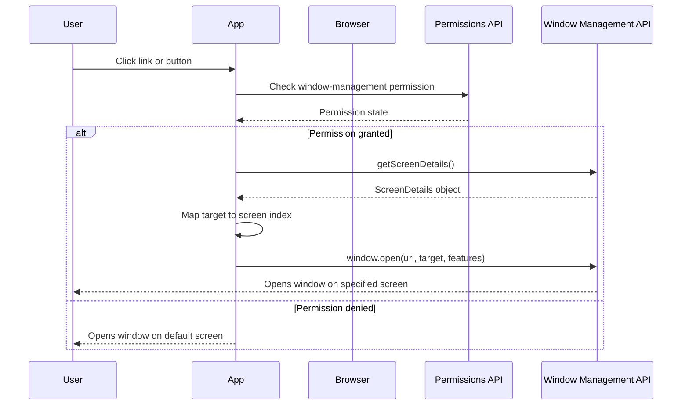

# Browser-Window-Management

Prototype for autodiscovery of screens and support browser window management for HTML anchor tags.

## Demo
Checkout the code and run with a webserver or see [Live Demo](https://fuasmattn.github.io/window-management/). Open Developer Console for Info Logs and connect additional monitors.

## Overview

This demo showcases the **Window Management API** (formerly known as Window Placement API) which allows web applications to manage windows across multiple screens. The application automatically discovers connected displays and can open, position, and manage windows on specific screens.

### How It Works



### Workflow Diagram

```
┌─────────────────────────────────────────────────────────────┐
│                     User Interaction                         │
└──────────────────────┬──────────────────────────────────────┘
                       │
                       ▼
┌─────────────────────────────────────────────────────────────┐
│         1. Check Window Management Permission                │
│            (window-management or window-placement)           │
└──────────────────────┬──────────────────────────────────────┘
                       │
                       ▼
             ┌─────────┴─────────┐
             │ Permission Granted?│
             └─────────┬─────────┘
                       │
          ┌────────────┼────────────┐
          │ Yes                     │ No
          ▼                         ▼
┌──────────────────────┐   ┌──────────────────┐
│ 2. Get Screen Details│   │ Fallback to      │
│    getScreenDetails() │   │ Primary Screen   │
└──────────┬───────────┘   └─────────┬────────┘
           │                         │
           ▼                         │
┌──────────────────────┐            │
│ 3. Detect Screens    │            │
│    - Primary         │            │
│    - Secondary       │            │
│    - Tertiary        │            │
└──────────┬───────────┘            │
           │                        │
           ▼                        │
┌──────────────────────┐            │
│ 4. Map Target to     │◄───────────┘
│    Screen Index      │
└──────────┬───────────┘
           │
           ▼
┌──────────────────────┐
│ 5. Open Window with  │
│    Calculated        │
│    Position & Size   │
└──────────────────────┘
```

## Browser API Support

This demo uses several modern browser APIs. Below is a detailed compatibility table:

### Window Management API

| Browser | Support | Version | Notes |
|---------|---------|---------|-------|
| Chrome | ✅ Yes | 100+ | Full support (formerly window-placement) |
| Edge | ✅ Yes | 100+ | Full support (Chromium-based) |
| Firefox | ❌ No | - | Not yet implemented |
| Safari | ❌ No | - | Not yet implemented |
| Opera | ✅ Yes | 86+ | Full support (Chromium-based) |

**API Features Used:**
- `window.getScreenDetails()` - Returns information about all connected screens
- `ScreenDetails` interface - Provides access to screen properties
- `screenschange` event - Fires when screens are connected/disconnected
- `currentscreenchange` event - Fires when the current screen changes

**MDN Reference:** [Window Management API](https://developer.mozilla.org/en-US/docs/Web/API/Window_Management_API)

### Permissions API

| Browser | Support | Version | Notes |
|---------|---------|---------|-------|
| Chrome | ✅ Yes | 43+ | Full support for window-management permission |
| Edge | ✅ Yes | 79+ | Full support |
| Firefox | ⚠️ Partial | 46+ | Permissions API supported, but not window-management permission |
| Safari | ⚠️ Partial | 16+ | Limited support |
| Opera | ✅ Yes | 30+ | Full support |

**API Features Used:**
- `navigator.permissions.query()` - Checks permission state
- Permission names: `window-management` (new) and `window-placement` (legacy)

**MDN Reference:** [Permissions API](https://developer.mozilla.org/en-US/docs/Web/API/Permissions_API)

### Fullscreen API

| Browser | Support | Version | Notes |
|---------|---------|---------|-------|
| Chrome | ✅ Yes | 71+ | Full support with screen option |
| Edge | ✅ Yes | 79+ | Full support |
| Firefox | ✅ Yes | 64+ | Full support (prefixed in older versions) |
| Safari | ✅ Yes | 16.4+ | Full support with screen option |
| Opera | ✅ Yes | 58+ | Full support |

**API Features Used:**
- `Element.requestFullscreen()` - Requests fullscreen mode
- `{ screen }` option - Specifies which screen to use for fullscreen

**MDN Reference:** [Fullscreen API](https://developer.mozilla.org/en-US/docs/Web/API/Fullscreen_API)

### Screen Interface Extensions

| Browser | Support | Version | Notes |
|---------|---------|---------|-------|
| Chrome | ✅ Yes | 100+ | Full support for isExtended |
| Edge | ✅ Yes | 100+ | Full support |
| Firefox | ❌ No | - | Not yet implemented |
| Safari | ❌ No | - | Not yet implemented |
| Opera | ✅ Yes | 86+ | Full support |

**API Features Used:**
- `window.screen.isExtended` - Boolean indicating if the display is extended across multiple screens

**MDN Reference:** [Screen.isExtended](https://developer.mozilla.org/en-US/docs/Web/API/Screen/isExtended)

### Window.open() Method

| Browser | Support | Version | Notes |
|---------|---------|---------|-------|
| Chrome | ✅ Yes | 1+ | Full support |
| Edge | ✅ Yes | 12+ | Full support |
| Firefox | ✅ Yes | 1+ | Full support |
| Safari | ✅ Yes | 1+ | Full support |
| Opera | ✅ Yes | 3+ | Full support |

**API Features Used:**
- `window.open(url, target, features)` - Opens a new window with specified features
- Window features: `left`, `top`, `width`, `height` for positioning

**MDN Reference:** [Window.open()](https://developer.mozilla.org/en-US/docs/Web/API/Window/open)

## Compatibility (Experimental)

⚠️ **Important:** The Window Management API is currently **experimental** and only available in Chromium-based browsers (Chrome, Edge, Opera).

### Current Status (2025)

- **Chromium Browsers (Chrome, Edge, Opera):** Full support since version 100+
- **Firefox:** Not yet implemented - tracking in [Bug 1732009](https://bugzilla.mozilla.org/show_bug.cgi?id=1732009)
- **Safari:** Not yet implemented - no public timeline

### Feature Detection

Always check for API availability before using:

```javascript
if ('getScreenDetails' in window) {
  // Window Management API is supported
  const screenDetails = await window.getScreenDetails();
  // Use the API
} else {
  // Fallback to standard window.open()
  console.log('Window Management API not supported');
}
```

### Permission Requirements

The demo requires the `window-management` permission (formerly `window-placement`). This is a powerful permission that:

- Requires user consent via a permission prompt
- Allows web applications to query information about all connected screens
- Enables precise window positioning across multiple displays
- Is only available in secure contexts (HTTPS)

### Apple Sidecar

Using an iPad as additional display should work with Chrome. However, the `ScreenDetails` change events do not fire when connecting or disconnecting the sidecar.

## API Details

### ScreenDetails Interface

The `ScreenDetails` interface provides:
- `screens` - Array of `ScreenDetailed` objects representing each connected screen
- `currentScreen` - The screen containing the browser window
- Events: `screenschange`, `currentscreenchange`

### ScreenDetailed Properties

Each screen object includes:
- `availWidth`, `availHeight` - Available screen dimensions
- `width`, `height` - Total screen dimensions
- `left`, `top` - Screen position relative to primary screen
- `isPrimary` - Boolean indicating if this is the primary screen
- `isInternal` - Boolean indicating if this is an internal display
- `devicePixelRatio` - Pixel density
- `label` - Human-readable screen identifier

## Use Cases

This demo is useful for:
- Multi-monitor trading applications
- Video conferencing tools with multiple screens
- Digital signage systems
- Presentation software
- Development tools and IDEs
- Multi-screen gaming experiences

## Resources

- [Chrome Developer Blog: Managing several displays with the Multi-Screen Window Placement API](https://developer.chrome.com/articles/window-management/)
- [MDN: Window Management API](https://developer.mozilla.org/en-US/docs/Web/API/Window_Management_API)
- [W3C Specification: Window Management](https://www.w3.org/TR/window-management/)
- [Can I Use: ScreenDetails](https://caniuse.com/mdn-api_screendetails)
